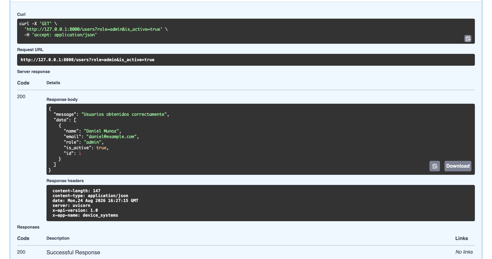
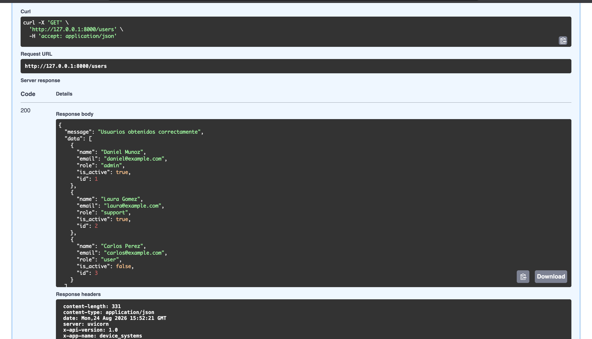
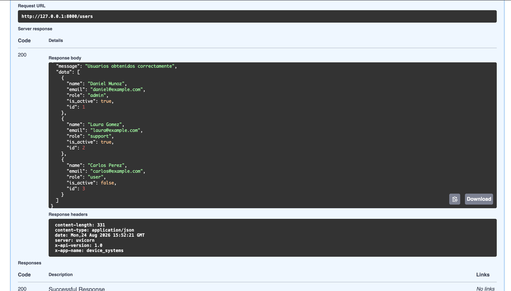
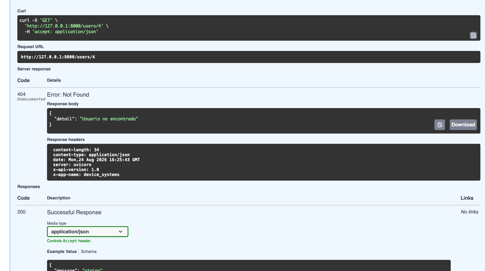

# device_systems

API REST desarrollada con FastAPI para administrar el recurso `users` del
sistema `device_systems`. La aplicación implementa validación con Pydantic v2,
parámetros de ruta y consulta, modelos de entrada/salida y cabeceras HTTP
personalizadas.

> El almacenamiento actual es una lista en memoria. Los usuarios creados se
> pierden al reiniciar el servidor; para este reto no se requiere una base de
> datos.

## Requisitos

- Python 3.10 o superior.
- `pip`.

## Estructura

```text
device_systems/
├── app/
│   ├── main.py
│   ├── routes/
│   │   └── user_routes.py
│   └── schemas/
│       └── user_schema.py
├── requirements.txt
└── README.md
```

## Instalación

Desde la carpeta raíz del proyecto:

```bash
python -m venv .venv
source .venv/bin/activate       # macOS/Linux
# .venv\Scripts\activate        # Windows PowerShell
python -m pip install -r requirements.txt
```

## Ejecución

```bash
uvicorn app.main:app --reload
```

La API estará disponible en `http://127.0.0.1:8000`.

- Swagger UI: http://127.0.0.1:8000/docs
- ReDoc: http://127.0.0.1:8000/redoc
- OpenAPI JSON: http://127.0.0.1:8000/openapi.json

## Modelo y validaciones

El cuerpo de `POST /users` debe incluir:

| Campo | Tipo | Validación |
| --- | --- | --- |
| `id` | entero | Obligatorio y mayor que cero; no se puede repetir |
| `name` | texto | Obligatorio, entre 3 y 100 caracteres |
| `email` | correo | Formato válido; no se puede repetir |
| `role` | texto | Solo `admin`, `support` o `user` |
| `is_active` | booleano | `true` o `false` |

La API devuelve `422 Unprocessable Entity` cuando el cuerpo o los parámetros
no cumplen estas reglas. Los modelos `UserCreate` y `UserResponse` evitan
acoplar la entrada y la salida del endpoint.

## Endpoints

| Método | Ruta | Descripción | Respuestas principales |
| --- | --- | --- | --- |
| `GET` | `/` | Verifica que la API esté funcionando | `200` |
| `GET` | `/users` | Lista todos los usuarios | `200` |
| `GET` | `/users?role=admin` | Filtra por rol | `200`, `422` |
| `GET` | `/users?is_active=true` | Filtra por estado | `200`, `422` |
| `GET` | `/users/{user_id}` | Consulta un usuario por ID | `200`, `404`, `422` |
| `POST` | `/users` | Registra un usuario | `201`, `409`, `422` |

Las respuestas de usuarios tienen el formato estandarizado:

```json
{
  "message": "Usuario obtenido correctamente",
  "data": {
    "id": 1,
    "name": "Daniel Munoz",
    "email": "daniel@example.com",
    "role": "admin",
    "is_active": true
  }
}
```

Todas las respuestas incluyen estas cabeceras:

```text
X-App-Name: device_systems
X-API-Version: 1.0
```

## Ejemplos de peticiones

### Listar usuarios

```bash
curl -i "http://127.0.0.1:8000/users"
```

### Filtrar usuarios

```bash
curl -i "http://127.0.0.1:8000/users?role=admin&is_active=true"
```

### Consultar por ID

```bash
curl -i "http://127.0.0.1:8000/users/1"
```

### Crear un usuario

```bash
curl -i -X POST "http://127.0.0.1:8000/users" \
  -H "Content-Type: application/json" \
  -d '{
    "id": 4,
    "name": "Ana Perez",
    "email": "ana@example.com",
    "role": "user",
    "is_active": true
  }'
```

### Validación de correo duplicado

Si se intenta registrar `daniel@example.com` nuevamente, la respuesta es:

```json
{
  "detail": "El correo ya está registrado"
}
```

con estado `409 Conflict`. Un correo inválido, un rol no permitido o un nombre
con menos de tres caracteres producen estado `422`.

## Evidencias de Swagger UI

Las pruebas se pueden repetir desde Swagger UI en
`http://127.0.0.1:8000/docs`, usando el botón **Try it out**. Estas son las
capturas disponibles en el proyecto:

### Filtro por rol y estado



La captura muestra `GET /users?role=admin&is_active=true`, una respuesta `200`
y las cabeceras `X-App-Name` y `X-API-Version`.

### Listado de usuarios



La captura muestra `GET /users` con los usuarios registrados y una respuesta
`200`.

### Captura adicional de respuesta de usuarios



Esta imagen también muestra una respuesta `200` de `/users`. Para evidenciar
específicamente `POST /users`, debe reemplazarse por una captura donde se vea
el cuerpo enviado y el código `201 Created`.

### Usuario no encontrado



La captura muestra la respuesta `404` de `GET /users/4` cuando el usuario no
existe. Para completar toda la evidencia solicitada, agrega además una captura
de `GET /users/{user_id}` con un ID existente y otra de validación `422`.

## Reflexión

FastAPI facilita la construcción de APIs REST porque genera documentación
interactiva a partir de las rutas y de los modelos Pydantic. En este proyecto,
los tipos de Python describen los parámetros y las respuestas, mientras que
Pydantic valida automáticamente los datos recibidos. Esto permite detectar
errores antes de guardar información y mantener respuestas consistentes para
los consumidores de la API.
