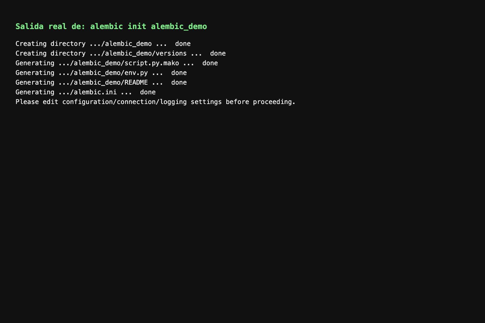
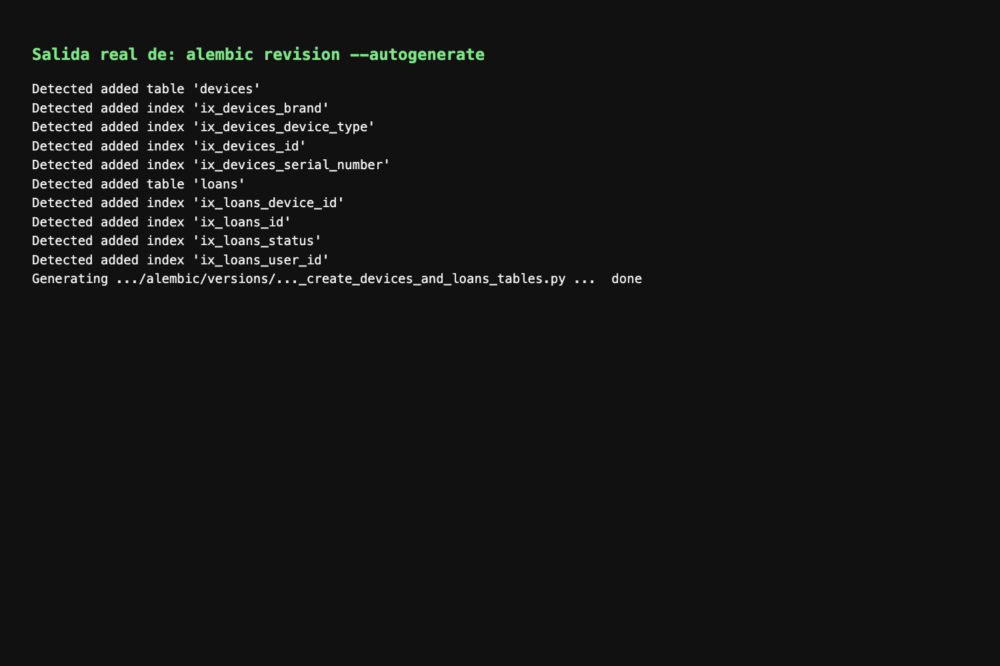
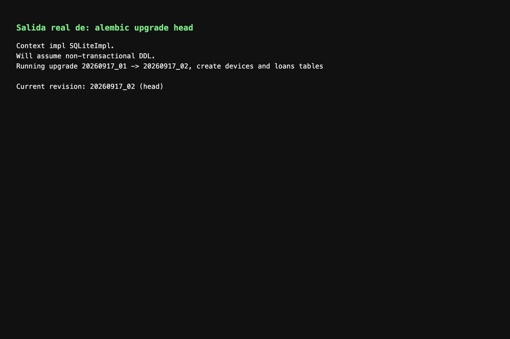
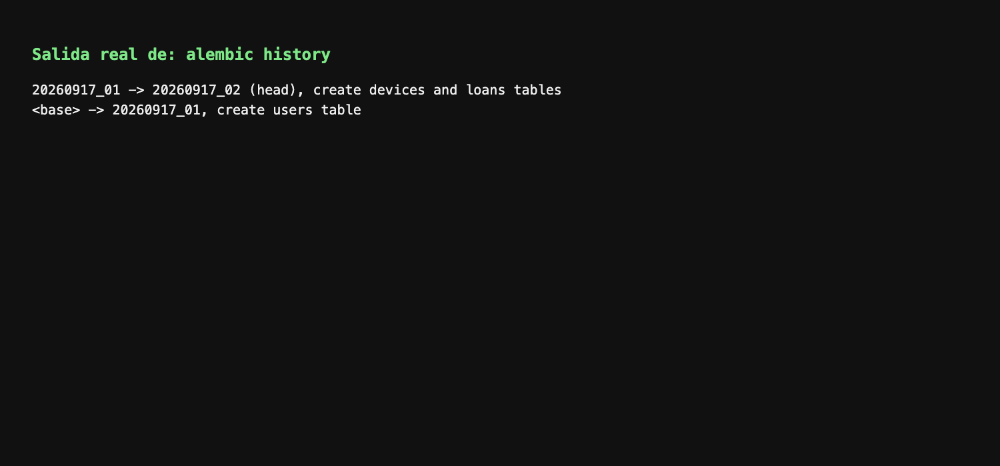
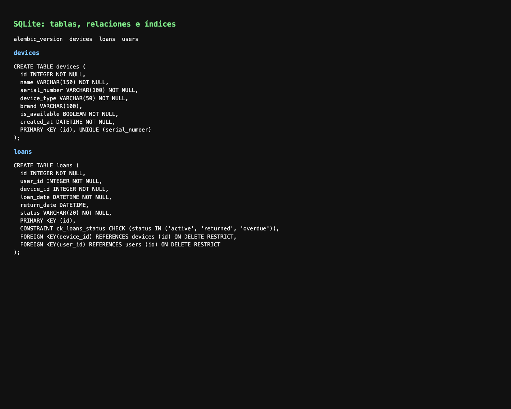
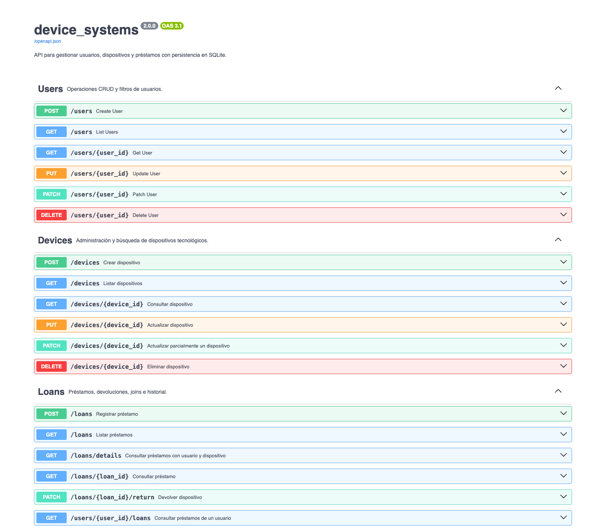
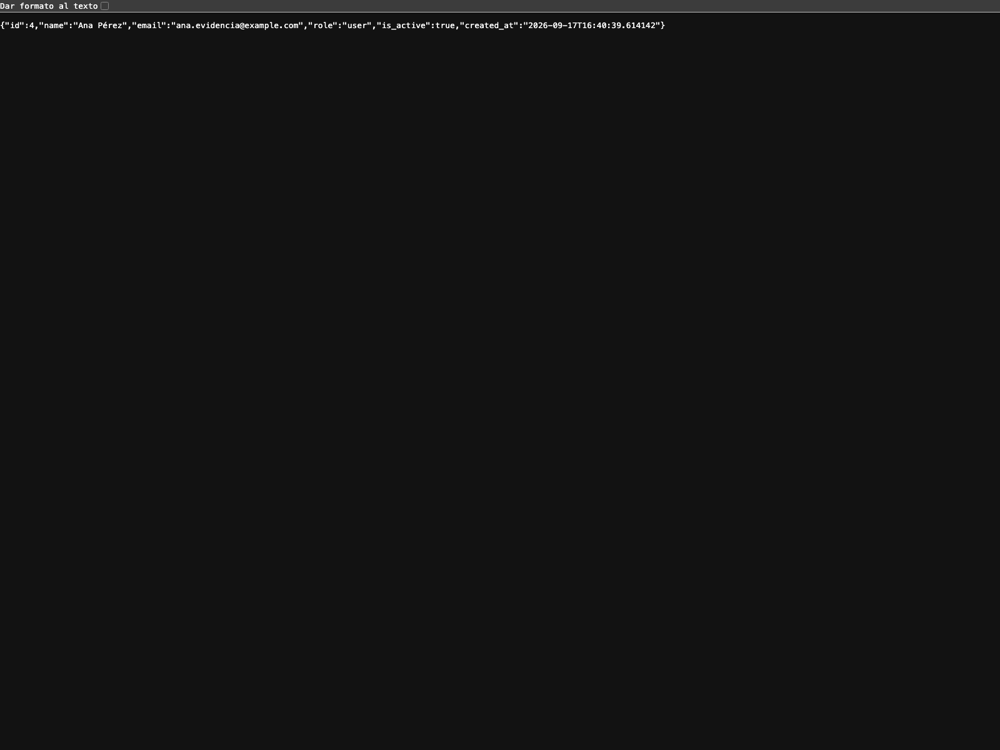
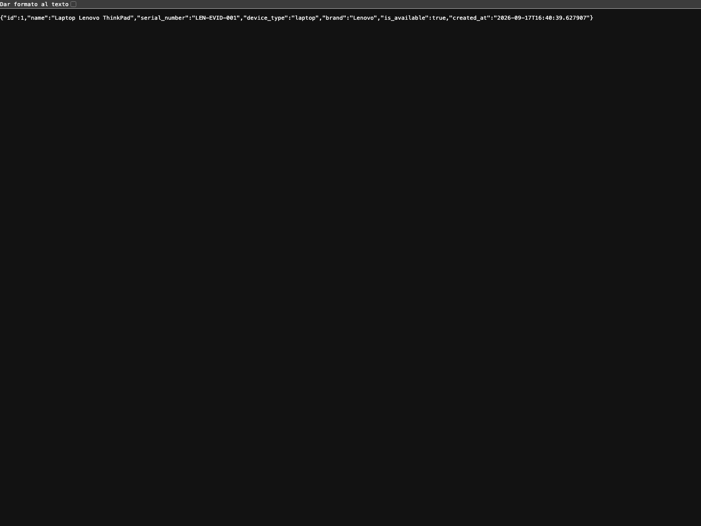
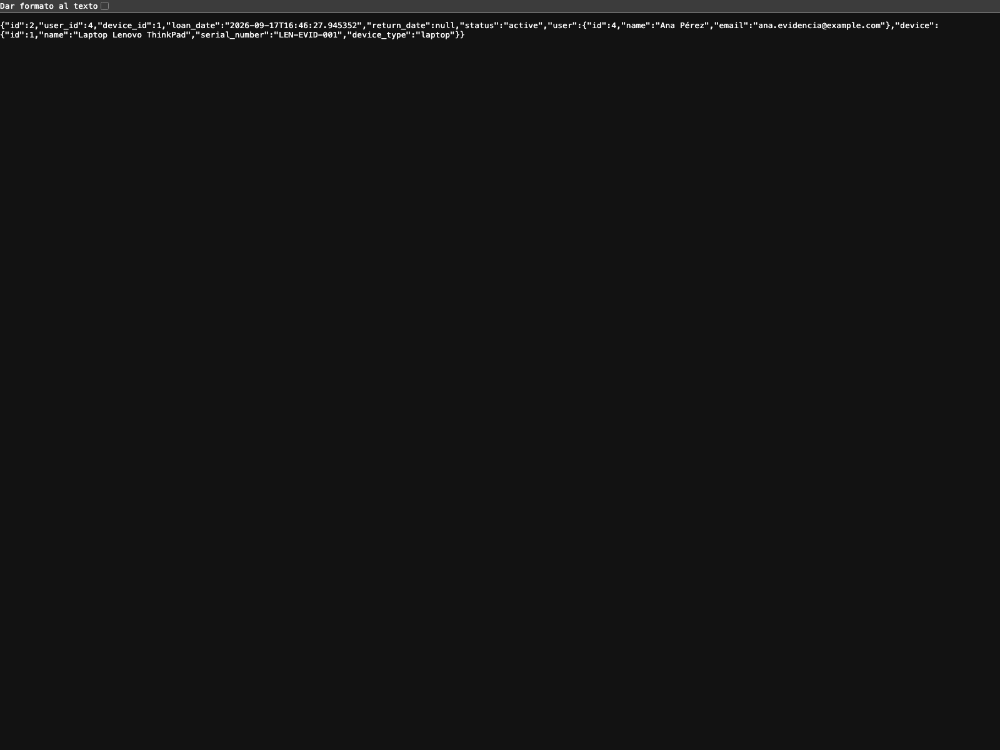
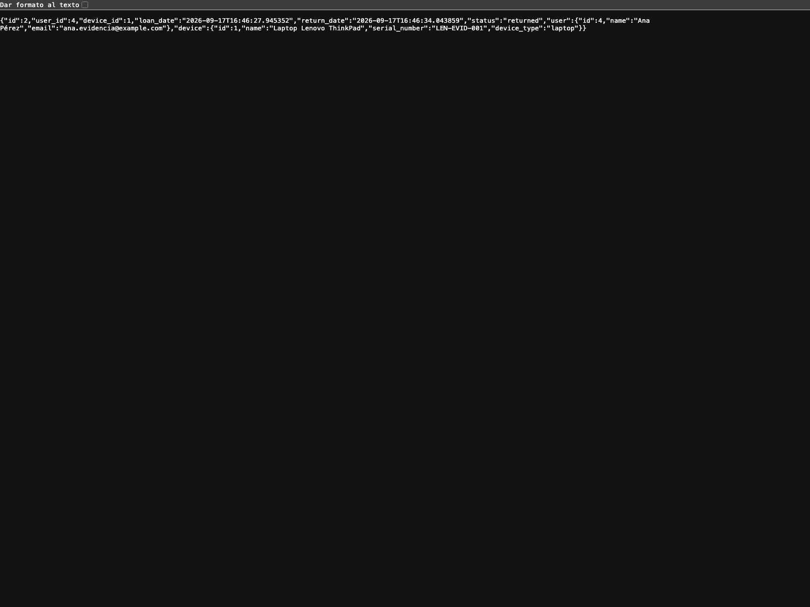

# device_systems

API REST de usuarios creada con FastAPI, SQLAlchemy, Alembic, Pydantic y SQLite.

## Ejecutar el proyecto

```bash
# Crear/actualizar el esquema antes de iniciar la API
venv/bin/alembic upgrade head
venv/bin/uvicorn app.main:app --reload
```

Documentación:

- http://127.0.0.1:8000/docs
- http://127.0.0.1:8000/redoc

## Estructura

- `app/database/connection.py`: engine, sesiones y Base.
- `app/models/user_model.py`: tabla `users` de SQLAlchemy.
- `alembic/env.py`: configuración de Alembic y metadata de SQLAlchemy.
- `alembic/versions/`: historial versionado de cambios de base de datos.
- `app/schemas/user_schema.py`: validaciones Pydantic.
- `app/dependencies/database_dependency.py`: sesión para los endpoints.
- `app/services/user_service.py`: operaciones CRUD y reglas de negocio.
- `app/routes/user_routes.py`: endpoints `/users`.

## Endpoints principales

- `POST /users`: crear usuario.
- `GET /users`: listar y filtrar por `role` o `is_active`.
- `GET /users/{user_id}`: consultar por ID.
- `PUT /users/{user_id}`: actualizar todos los campos.
- `PATCH /users/{user_id}`: actualizar algunos campos.
- `DELETE /users/{user_id}`: eliminar usuario.

El modelo SQLAlchemy representa la tabla de la base de datos. Los schemas Pydantic validan los datos que entran y salen de la API.

## Migraciones con Alembic

Alembic administra la estructura de la base de datos. La aplicación no crea tablas automáticamente al iniciar; primero deben aplicarse las migraciones.

```bash
# Ver el estado actual
venv/bin/alembic current

# Aplicar todas las migraciones pendientes
venv/bin/alembic upgrade head

# Consultar el historial
venv/bin/alembic history
```

Cuando se modifiquen los modelos, generar una nueva revisión y revisarla antes de aplicarla:

```bash
venv/bin/alembic revision --autogenerate -m "describe schema change"
venv/bin/alembic upgrade head
```

La migración inicial `20260917_01` crea la tabla `users`, sus restricciones y sus índices. Si se usa una base SQLite existente que ya contiene esa tabla, registrar la línea base una sola vez con:

```bash
venv/bin/alembic stamp 20260917_01
```

La revisión `20260917_02` crea `devices` y `loans`, incluyendo las claves foráneas, el estado del préstamo y los índices de consulta.

## Seguridad y autenticación

La versión 3.0 agrega OAuth2 con JWT, hash bcrypt mediante `passlib`, validaciones avanzadas con Pydantic v2, CORS, middleware de trazabilidad y rate limiting con `slowapi`.

### Configuración

Duplica `.env.example` como `.env` y reemplaza `JWT_SECRET_KEY` por un secreto aleatorio largo. El archivo `.env` está ignorado por Git y nunca debe publicarse.

```bash
cp .env.example .env
venv/bin/python -m pip install -r requirements.txt
venv/bin/alembic upgrade head
venv/bin/uvicorn app.main:app --reload
```

La contraseña nunca se guarda en texto plano: `/auth/register` la valida y la transforma a un hash bcrypt antes de insertarla. Los response models solo exponen los datos públicos del usuario y nunca `hashed_password`.

### Autenticación

- `POST /auth/register`: registra un usuario con contraseña segura.
- `POST /auth/login`: recibe `username` como email y `password` usando `application/x-www-form-urlencoded`, como exige OAuth2 Password Flow.
- `GET /auth/me`: devuelve el usuario autenticado con `Authorization: Bearer <token>`.

Ejemplo de login:

```bash
curl -X POST http://127.0.0.1:8000/auth/login \
  -H "Content-Type: application/x-www-form-urlencoded" \
  -d "username=ana@sena.edu.co&password=Segura2026"
```

### Protección por roles

Las rutas privadas responden `401 Unauthorized` si falta o es inválido el JWT y `403 Forbidden` si el usuario autenticado no tiene el rol requerido.

| Ruta | Protección |
| --- | --- |
| `GET /users` y `GET /users/{user_id}` | Usuario autenticado |
| `POST /devices`, `PUT/PATCH /devices/{device_id}` | `admin` o `support` |
| `DELETE /devices/{device_id}` | `admin` |
| `POST /loans` | Usuario autenticado |
| `PATCH /loans/{loan_id}/return` | `admin` o `support` |
| `GET /loans/details` | `admin` o `support` |

Las operaciones administrativas de usuarios también requieren `admin`. La respuesta de `/auth/me` conserva el rol, pero nunca incluye `hashed_password`.

### Middleware y CORS

El middleware global registra método, ruta, estado y duración, y agrega:

```text
X-App-Name: device_systems
X-Process-Time: 0.0042
X-Request-ID: 8f42e9c1
```

Si el cliente envía `X-Request-ID`, se propaga; de lo contrario se genera un UUID. También se agregan cabeceras defensivas `X-Content-Type-Options`, `X-Frame-Options` y `Referrer-Policy`.

CORS permite por defecto `http://localhost:5173` y `http://localhost:3000`, y puede configurarse con `CORS_ORIGINS` separado por comas. No se recomienda usar `*` en producción junto con `allow_credentials=True`, porque permitiría solicitudes con credenciales desde cualquier origen y debilitaría el control de confianza entre frontend y API.

### Rate limiting

`slowapi` identifica al cliente por IP y aplica un límite global de `120/minute`, además de los límites específicos:

- `POST /auth/login`: 5 solicitudes por minuto.
- `POST /auth/register`: 3 solicitudes por minuto.
- `GET /users`: 30 solicitudes por minuto.
- `POST /loans`: 10 solicitudes por minuto.

Al superar un límite, la API responde `429 Too Many Requests`. La prueba se puede evidenciar repitiendo rápidamente la misma petición desde Swagger UI o con `curl`.

### Resultados verificados localmente

Se validaron de forma funcional el registro exitoso (`201`), el rechazo de contraseña débil (`422`), el email duplicado (`409`), el login correcto (`200`), el login incorrecto (`401`), `/auth/me` sin token o con token inválido (`401`), el acceso autenticado a usuarios (`200`), la restricción de un usuario común al crear dispositivos (`403`), la creación de dispositivos por `support` (`201`), el acceso de `support` a `/loans/details` (`200`), CORS (`200`), las cabeceras de trazabilidad y el límite de login (`429`). También se comprobó que Alembic está en `20260917_03 (head)` y que `alembic check` no detecta operaciones pendientes.

### Validaciones avanzadas

`UserRegister` usa `Field()`, `field_validator()` y `ConfigDict` de Pydantic v2. La contraseña debe tener entre 8 y 72 bytes, una mayúscula, una minúscula y un número, y no puede contener espacios. El email se normaliza a minúsculas, el nombre se limpia y los roles se limitan a `admin`, `support` y `user`.

### Evidencias de seguridad

Las capturas de la actividad anterior permanecen en `docs/evidencias/`. Para esta actividad se deben documentar desde Swagger o Postman las pruebas de registro correcto y débil, email duplicado, login correcto e incorrecto, `/auth/me`, acceso sin token y con token inválido, autorización por rol, CORS, cabeceras `X-*`, rate limiting y el esquema OAuth2 visible en `/docs`.

La migración `20260917_03` agrega `hashed_password` de forma compatible con usuarios existentes, asignando un hash de transición no utilizable y obligando el campo a partir de ese punto. Los nuevos usuarios solo deben registrarse mediante `/auth/register` para establecer una contraseña conocida por su propietario.

## Estructura relacionada

Un usuario puede tener muchos préstamos y un dispositivo puede aparecer en muchos préstamos históricos. Cada préstamo pertenece exactamente a un usuario y a un dispositivo mediante claves foráneas.

## Endpoints de dispositivos

- `POST /devices`: crear dispositivo.
- `GET /devices`: listar dispositivos con filtros `device_type`, `is_available`, `brand` y `search`.
- `GET /devices/{device_id}`: consultar dispositivo.
- `PUT /devices/{device_id}`: reemplazar dispositivo.
- `PATCH /devices/{device_id}`: actualizar parcialmente.
- `DELETE /devices/{device_id}`: eliminar dispositivo sin historial de préstamos.

## Endpoints de préstamos

- `POST /loans`: crear préstamo y marcar el dispositivo como no disponible.
- `GET /loans`: listar préstamos con filtros opcionales.
- `GET /loans/details`: listar préstamos con información del usuario y del dispositivo usando joins.
- `GET /loans/{loan_id}`: consultar préstamo detallado.
- `PATCH /loans/{loan_id}/return`: registrar devolución y liberar el dispositivo.
- `GET /users/{user_id}/loans`: historial del usuario.
- `GET /devices/{device_id}/loans`: historial del dispositivo.

Ejemplos de filtros:

```text
/loans?status=active
/loans?user_email=ana@sena.edu.co
/loans?device_type=laptop
/loans?search=thinkpad
/devices?is_available=true&brand=lenovo
```

## Evidencias de aprendizaje

Las capturas se almacenan en `docs/evidencias/` y documentan la ejecución de migraciones, Swagger, creación de recursos, consultas relacionadas, filtros y devolución.

### Alembic y base de datos











### API y Swagger












## Reflexión

Alembic permite controlar la evolución de la base de datos mediante migraciones versionadas, evitando cambios manuales y facilitando el trabajo colaborativo. Las relaciones entre usuarios, dispositivos y préstamos mantienen la integridad referencial del sistema. Finalmente, las consultas con `join`, `where`, `ilike`, `and_` y `or_` permiten entregar información relacionada y aplicar búsquedas útiles sin duplicar lógica en los endpoints.
